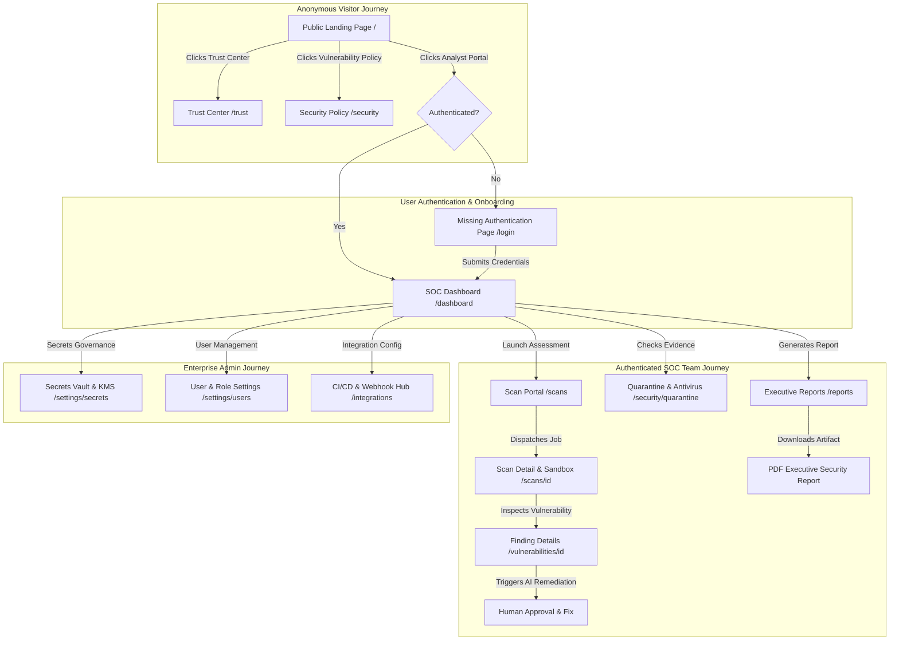

# Vulnova Enterprise Security Platform — Frontend Product Inventory & Discovery Audit

**Audit Date**: August 10, 2026  
**Auditors**: Senior Product Manager, Enterprise UX Analyst, Senior Full Stack Architect  
**Objective**: Comprehensive product discovery, user journey mapping, navigation audit, route health verification, and functional defect categorization across the Vulnova Frontend Application.

---

## TASK 1: Complete Frontend Product Inventory

This section details every page, route, visual section, button, form, table, modal, and action element across the Vulnova Frontend application.

---

### Page 1: Landing / Homepage
- **Route**: `/`
- **Purpose**: Present Vulnova's enterprise value proposition to public visitors and offer entry points into the Analyst Portal or Trust Center.
- **Layout Wrapper**: `TrustHeader` (Public Navigation Bar)
- **Visible Sections**:
  1. Hero Header Banner (Era 7 Enterprise AppSec Platform tag, headline, tagline)
  2. Action CTA Group (`Enter Analyst Portal`, `Enterprise Trust Center`)
  3. Feature Cards Grid (Distributed Scanning Sandbox, Autonomous AI Analyst, Real-Time SOC Dashboard)
  4. Footer CTA Banner (`Trust Center`, `Launch Portal`)
- **Buttons & Action Elements**:

| Button / Action Name | Location | Expected Behaviour | API Required | Current Status |
| :--- | :--- | :--- | :--- | :--- |
| **Enter Analyst Portal** | Hero CTA | Navigate to `/dashboard` | None | Connected (Redirects to `/dashboard`) |
| **Enterprise Trust Center** | Hero CTA | Navigate to `/trust` | None | Connected (Redirects to `/trust`) |
| **Trust Center** | Footer Banner | Navigate to `/trust` | None | Connected (Redirects to `/trust`) |
| **Launch Portal** | Footer Banner | Navigate to `/dashboard` | None | Connected (Redirects to `/dashboard`) |

---

### Page 2: SOC Operations Command Dashboard
- **Route**: `/dashboard`
- **Purpose**: Provide security analysts with real-time composite risk scores, vulnerability distribution, active scan telemetry, attack surface coverage, and executive export options.
- **Layout Wrapper**: `<DashboardLayout>` (Sidebar & Header)
- **Visible Sections**:
  1. Header Action Bar (Security Operations Command title & Executive Export button)
  2. Security Posture Summary Card (Composite Risk Score, Posture Status, Open Findings Count)
  3. Historical Risk Trajectory Chart (7/30/90/365-day trend velocity)
  4. Active Scan Monitor & Vulnerability Breakdown Chart
  5. Attack Surface Coverage & Threat Advisories Drawer
  6. Top Vulnerable Assets Overview & Recurring Scan Schedules Summary
- **Buttons & Action Elements**:

| Button / Action Name | Location | Expected Behaviour | API Required | Current Status |
| :--- | :--- | :--- | :--- | :--- |
| **Export Executive Report** | Header Action Bar | Trigger PDF / HTML Executive Report generation & download | `POST /api/v1/reports/executive` | Connected (Invokes `ReportsService`) |
| **View Vulnerabilities** | Asset Risk Overview | Navigate to `/findings` or vulnerability detail | `GET /api/v1/findings` | **BROKEN** (`/findings` route does not exist -> 404) |
| **Manage Schedules** | Schedules Overview | Navigate to `/schedules` | `GET /api/v1/schedules` | **BROKEN** (`/schedules` route does not exist -> 404) |

---

### Page 3: Scan Execution Portal
- **Route**: `/scans`
- **Purpose**: Dispatch automated vulnerability assessment jobs, select profiles, filter active/completed jobs, and monitor containerized scanner progress.
- **Layout Wrapper**: `<DashboardLayout>`
- **Visible Sections**:
  1. Header Action Bar (Portal title & `Dispatch Scan Job` button)
  2. Status Filter Bar (`ALL`, `ASSESSING`, `COMPLETED`, `FAILED`) & Search input
  3. Scan List Data Table (`ScanListTable`)
  4. Dispatch Scan Modal (`ScanDispatchModal`)
- **Buttons & Action Elements**:

| Button / Action Name | Location | Expected Behaviour | API Required | Current Status |
| :--- | :--- | :--- | :--- | :--- |
| **Dispatch Scan Job** | Header Action Bar | Open `ScanDispatchModal` | None | Connected (Opens Modal) |
| **Start Scan** | Inside Dispatch Modal | Submit target URL & profile to launch scan | `POST /api/v1/scans` | Connected |
| **View Scan Details** | Table Row | Navigate to `/scans/[id]` detail page | `GET /api/v1/scans/{id}` | Connected |
| **Cancel Scan** | Table Row Action | Terminate running container sandbox | `POST /api/v1/scans/{id}/cancel` | Partial (API connected) |

---

### Page 4: Scan Job Detail View
- **Route**: `/scans/[id]`
- **Purpose**: Display live WebSocket execution log, step-by-step progress, container sandbox ID, and discovered findings for a specific scan job.
- **Layout Wrapper**: `<DashboardLayout>`
- **Visible Sections**:
  1. Scan Header (Target URL, Status Badge, Execution Time)
  2. Container Sandbox Metadata Panel (Container ID, CPU/Memory limits, UID 10001 status)
  3. Live Terminal / WebSocket Execution Log
  4. Discovered Findings Table
- **Buttons & Action Elements**:

| Button / Action Name | Location | Expected Behaviour | API Required | Current Status |
| :--- | :--- | :--- | :--- | :--- |
| **Back to Scans** | Header | Navigate back to `/scans` | None | Connected |
| **Cancel Scan Job** | Header Action | Abort scan execution | `POST /api/v1/scans/{id}/cancel` | Connected |
| **View Finding** | Findings Table | Navigate to `/vulnerabilities/[id]` | `GET /api/v1/findings/{id}` | Connected |

---

### Page 5: Executive Reports & Exports
- **Route**: `/reports`
- **Purpose**: Allow CISOs and security managers to generate presentation-ready PDF reports, preview executive summaries, and track posture trajectory.
- **Layout Wrapper**: None (Missing `<DashboardLayout>` wrapper!)
- **Visible Sections**:
  1. Page Header (Title, Refresh & `Generate Report` buttons)
  2. Overview Cards (PDF Generator, Trajectory Analytics, Compliance Mappings)
  3. Search & Filter Bar
  4. Executive Reports Grid (`ExecutiveReportCard`)
  5. Report Generation Modal (`ReportGenerationModal`)
- **Buttons & Action Elements**:

| Button / Action Name | Location | Expected Behaviour | API Required | Current Status |
| :--- | :--- | :--- | :--- | :--- |
| **Generate Report** | Header | Open `ReportGenerationModal` | None | Connected |
| **Download PDF** | Report Card | Download rendered PDF binary | `GET /api/v1/reports/{id}/pdf` | Connected |
| **View Report** | Report Card | Navigate to `/reports/[id]` | `GET /api/v1/reports/{id}` | Connected |

---

### Page 6: Executive Report Interactive View
- **Route**: `/reports/[id]`
- **Purpose**: Render HTML preview of CISO executive security report payload.
- **Layout Wrapper**: None (Missing `<DashboardLayout>`)
- **Visible Sections**:
  1. Header Bar (Report Title, Timestamp, Download PDF button)
  2. Executive Summary Metrics Grid
  3. Top Findings & Remediation Guidance List
- **Buttons & Action Elements**:

| Button / Action Name | Location | Expected Behaviour | API Required | Current Status |
| :--- | :--- | :--- | :--- | :--- |
| **Download PDF Report** | Header Bar | Download PDF binary | `GET /api/v1/reports/{id}/pdf` | Connected |
| **Back to Reports** | Header Bar | Navigate to `/reports` | None | Connected |

---

### Page 7: Compliance Frameworks Portal
- **Route**: `/compliance`
- **Purpose**: Audit organization compliance posture across NIST CSF 2.0, ISO 27001, SOC 2 Type II, and PCI-DSS 4.0.
- **Layout Wrapper**: `<DashboardLayout>`
- **Visible Sections**:
  1. Header Action Bar (Frameworks title & export options)
  2. Framework Cards Grid (NIST, ISO, SOC2, PCI-DSS score cards)
  3. Control Requirements Compliance Table
- **Buttons & Action Elements**:

| Button / Action Name | Location | Expected Behaviour | API Required | Current Status |
| :--- | :--- | :--- | :--- | :--- |
| **Explore Framework** | Framework Card | Navigate to `/compliance/[framework]` | `GET /api/v1/compliance/{framework}` | Connected |
| **Export Audit Evidence** | Header | Download compliance evidence zip | `GET /api/v1/compliance/export` | Connected |

---

### Page 8: Framework Compliance Detail
- **Route**: `/compliance/[framework]`
- **Purpose**: Detailed control mapping and gap analysis for a specific compliance standard (e.g. `nist-csf`).
- **Layout Wrapper**: `<DashboardLayout>`
- **Visible Sections**:
  1. Framework Title & Score Progress
  2. Control Subcategories Accordion
  3. Failed Controls & Remediation Plan List
- **Buttons & Action Elements**:

| Button / Action Name | Location | Expected Behaviour | API Required | Current Status |
| :--- | :--- | :--- | :--- | :--- |
| **Back to Compliance** | Header | Navigate to `/compliance` | None | Connected |

---

### Page 9: Integrations Hub
- **Route**: `/integrations`
- **Purpose**: Configure third-party integrations (Jira, GitHub Actions, Slack, PagerDuty, DefectDojo).
- **Layout Wrapper**: `<DashboardLayout>`
- **Visible Sections**:
  1. Integration Category Cards (CI/CD, Issue Trackers, SIEM, Webhooks)
  2. Integration Status List
- **Buttons & Action Elements**:

| Button / Action Name | Location | Expected Behaviour | API Required | Current Status |
| :--- | :--- | :--- | :--- | :--- |
| **Configure CI/CD** | Integration Card | Navigate to `/integrations/ci-cd` | None | Connected |
| **Integration Settings** | Header | Navigate to `/integrations/settings` | None | Connected |

---

### Page 10: CI/CD Security Integration
- **Route**: `/integrations/ci-cd`
- **Purpose**: Display CLI scanner token generation and GitHub Actions / GitLab CI pipeline YAML snippets.
- **Layout Wrapper**: `<DashboardLayout>`
- **Visible Sections**:
  1. CLI Authentication Token Generator
  2. Pipeline Snippet Selector (GitHub Actions, GitLab, Bitbucket)
- **Buttons & Action Elements**:

| Button / Action Name | Location | Expected Behaviour | API Required | Current Status |
| :--- | :--- | :--- | :--- | :--- |
| **Generate Token** | CLI Section | Create new CLI API token | `POST /api/v1/cli/tokens` | Connected |
| **Copy YAML** | Code Block | Copy YAML snippet to clipboard | None | Connected |

---

### Page 11: Integration Settings
- **Route**: `/integrations/settings`
- **Purpose**: Configure webhook URLs and API keys for Slack/Jira.
- **Layout Wrapper**: `<DashboardLayout>`
- **Visible Sections**: Webhook Configuration Form.
- **Buttons & Action Elements**: `Save Webhook Settings` (`POST /api/v1/integrations/settings`).

---

### Page 12: Notification Center
- **Route**: `/notifications`
- **Purpose**: View real-time security alerts and system events.
- **Layout Wrapper**: `<DashboardLayout>`
- **Visible Sections**: Notification Feed List.
- **Buttons & Action Elements**: `Mark All Read` (`POST /api/v1/notifications/mark-read`), `Notification Settings` (`/notifications/settings`).

---

### Page 13: Notification Settings
- **Route**: `/notifications/settings`
- **Purpose**: Set email and Slack alerting thresholds.
- **Layout Wrapper**: `<DashboardLayout>`
- **Buttons & Action Elements**: `Save Notification Preferences`.

---

### Page 14: Multi-Factor Authentication (MFA) Setup
- **Route**: `/security/mfa`
- **Purpose**: Enable PyOTP TOTP 2FA authentication.
- **Layout Wrapper**: `<DashboardLayout>`
- **Visible Sections**: QR Code Display (`QRCodeDisplay`), TOTP Verification Code Input.
- **Buttons & Action Elements**: `Verify & Enable MFA` (`POST /api/v1/auth/mfa/enable`).

---

### Page 15: Security Quarantine & Evidence Protection Dashboard
- **Route**: `/security/quarantine`
- **Purpose**: Monitor ClamAV daemon scanning, YARA static malware inspection, object staging in `vulnova-quarantine-bucket`, and promote verified evidence to production.
- **Layout Wrapper**: None (Missing `<DashboardLayout>`)
- **Visible Sections**:
  1. Header Banner & Telemetry Metric Cards
  2. Evidence File Upload Dropzone
  3. Malware Quarantine Alert Log
- **Buttons & Action Elements**:

| Button / Action Name | Location | Expected Behaviour | API Required | Current Status |
| :--- | :--- | :--- | :--- | :--- |
| **Upload Evidence File** | Upload Dropzone | Stage file in quarantine bucket and execute threat scan | `POST /api/v1/evidence/upload` | Connected |
| **Promote Evidence** | Quarantine Table Row | Move clean file from quarantine bucket to production | `POST /api/v1/evidence/{id}/promote` | Connected |
| **Refresh Telemetry** | Header | Reload quarantine summary metrics | `GET /api/v1/security/quarantine` | Connected |

---

### Page 16: Enterprise Secrets Vault & KMS Governance
- **Route**: `/settings/secrets`
- **Purpose**: Governance panel for zero-trust envelope encryption, external KMS providers (AWS KMS, GCP KMS, Vault, Local), secret storage, decryption, and rotation.
- **Layout Wrapper**: None (Missing `<DashboardLayout>`)
- **Visible Sections**:
  1. Telemetry Summary Cards (Active KMS Provider, Total Secrets, Rotations Due)
  2. Secret Repository Table (`SecretsVaultPanel`)
  3. Store Secret Modal
- **Buttons & Action Elements**:

| Button / Action Name | Location | Expected Behaviour | API Required | Current Status |
| :--- | :--- | :--- | :--- | :--- |
| **Store Secret** | Header | Open Store Secret Modal | None | Connected |
| **Reveal Value** | Table Row | Decrypt and show plaintext payload | `POST /api/v1/secrets/{id}/access` | Connected |
| **Rotate DEK** | Table Row | Execute on-demand DEK rotation | `POST /api/v1/secrets/{id}/rotate` | Connected |
| **Delete Secret** | Table Row | Permanently remove secret entry | `DELETE /api/v1/secrets/{id}` | Connected |

---

### Page 17: API Keys Management
- **Route**: `/settings/api-keys`
- **Purpose**: Issue and revoke machine-to-machine API keys.
- **Layout Wrapper**: None (Missing `<DashboardLayout>`)
- **Buttons & Action Elements**: `Create API Key` (`POST /api/v1/api-keys`), `Revoke Key` (`DELETE /api/v1/api-keys/{id}`).

---

### Page 18: Organization Profile Settings
- **Route**: `/settings/organization`
- **Purpose**: Manage company name, domain verification, and billing tier.
- **Layout Wrapper**: None (Missing `<DashboardLayout>`)
- **Buttons & Action Elements**: `Save Organization Details` (`PATCH /api/v1/organizations/me`).

---

### Page 19: Role-Based Access Control (RBAC) Settings
- **Route**: `/settings/roles`
- **Purpose**: Configure custom RBAC permission matrices (`ADMIN`, `SECURITY_ANALYST`, `AUDITOR`, `DEVOPS`).
- **Layout Wrapper**: None (Missing `<DashboardLayout>`)
- **Buttons & Action Elements**: `Update Role Permissions` (`PUT /api/v1/roles/{id}`).

---

### Page 20: Security Governance Settings
- **Route**: `/settings/security`
- **Purpose**: Set IP whitelist, session timeouts, and password complexity rules.
- **Layout Wrapper**: None (Missing `<DashboardLayout>`)
- **Buttons & Action Elements**: `Save Security Settings` (`PUT /api/v1/settings/security`).

---

### Page 21: User Management Settings
- **Route**: `/settings/users`
- **Purpose**: Invite, suspend, or modify enterprise team members.
- **Layout Wrapper**: None (Missing `<DashboardLayout>`)
- **Buttons & Action Elements**: `Invite User` (`POST /api/v1/users/invite`), `Deactivate User` (`DELETE /api/v1/users/{id}`).

---

### Pages 22–31: Security Validation Suite Pages
- **Routes**:
  - `/validation/api-security`
  - `/validation/certification`
  - `/validation/container`
  - `/validation/infrastructure`
  - `/validation/owasp`
  - `/validation/pentest`
  - `/validation/regression`
  - `/validation/sca`
  - `/validation/secrets`
  - `/validation/threat`
- **Purpose**: Domain-specific validation telemetry dashboards verifying OWASP ASVS v4.0, SCA dependencies, container rootfs isolation, infrastructure security, pentest verification, secrets, and threat modeling.
- **Layout Wrapper**: `<DashboardLayout>`
- **Buttons & Action Elements**: `Run Validation Suite` (`POST /api/v1/validation/{domain}/run`), `Export Compliance Evidence`.

---

### Page 32: Database Performance & Vector Metrics
- **Route**: `/database/performance`
- **Purpose**: Telemetry panel monitoring PostgreSQL query latency, pool utilization, index hit ratio, and pgvector HNSW indexing.
- **Layout Wrapper**: `<DashboardLayout>`
- **Buttons & Action Elements**: `Analyze Queries` (`GET /api/v1/database/performance`).

---

### Page 33: Vulnerability Finding Detail View
- **Route**: `/vulnerabilities/[id]`
- **Purpose**: Inspect CVSS 4.0 score, AI confidence analysis, proof-of-exploit evidence, and AI human-in-the-loop remediation recommendation.
- **Layout Wrapper**: None (Missing `<DashboardLayout>`)
- **Buttons & Action Elements**: `Approve Remediation` (`POST /api/v1/findings/{id}/remediate`), `Reject Finding` (`POST /api/v1/findings/{id}/false-positive`).

---

### Page 34: Vulnerability Disclosure Policy
- **Route**: `/security` (Public)
- **Purpose**: Public disclosure guidelines and security reporting policy.
- **Layout Wrapper**: `TrustHeader`

---

### Page 35: Enterprise Trust Center
- **Route**: `/trust` (Public)
- **Purpose**: Live security posture, SOC 2 compliance status, and security certification downloads.
- **Layout Wrapper**: `TrustHeader`

---

## TASK 2: Complete User Journey Documentation

### Journey 1: Anonymous Visitor & Prospect
1. Visitor arrives at `https://vulnova.com/` (`/`).
2. Reviews platform capability cards (Container Sandbox DAST, AI Analyst, SOC Dashboard).
3. Navigates to `/trust` to inspect compliance certifications (SOC 2, ISO 27001) or `/security` for vulnerability disclosure.
4. Clicks **Analyst Portal** button to log into the platform. *(Gap: Currently redirects straight to `/dashboard` because no `/login` page exists).*

### Journey 2: Authenticated Security Analyst
1. Logs into Vulnova Control Plane.
2. Views **SOC Operations Command Dashboard** (`/dashboard`), observing Composite Risk Score (78.5) and Critical Findings count.
3. Navigates to **Active Scans** (`/scans`), clicks **Dispatch Scan Job**, enters target URL `https://api.example.com` and profile `FULL_RECON`.
4. Monitors live terminal execution log on `/scans/[id]`.
5. Clicks discovered finding to open `/vulnerabilities/[id]`, reviews CVSS 4.0 score and AI-recommended code patch.
6. Approves AI remediation and generates CISO Executive Report on `/reports`.

### Journey 3: Enterprise Admin & SecOps Engineer
1. Navigates to `/settings/secrets` to configure AWS KMS / HashiCorp Vault Key Encryption Keys (KEK).
2. Stores integration tokens encrypted via AES-256-GCM envelope encryption.
3. Navigates to `/security/quarantine` to inspect blocked malware upload attempts and promote clean evidence files.
4. Navigates to `/integrations/ci-cd` to generate machine CLI authentication tokens for GitHub Actions security pipelines.

---

## TASK 3: Navigation Structure Audit

### 1. Main Website Public Navbar (`TrustHeader`)
- **Current Items**:
  - Logo (`/` -> Landing Page)
  - `Trust Center` (`/trust`)
  - `Vulnerability Disclosure` (`/security`)
  - `security.txt` (`/.well-known/security.txt`)
  - `StatusWidget` (Operational)
  - `Analyst Portal` button (`/dashboard`)
- **Missing Items**:
  - ❌ `Sign In` / `Login` button
  - ❌ `Sign Up` / `Request Enterprise Demo` button
  - ❌ `Documentation` link

### 2. Dashboard Navigation Header & Sidebar (`DashboardLayout`)
- **Current Sidebar Links**:
  - Operations Control: `/dashboard`, `/scans`, `/schedules` ❌, `/integrations`, `/notifications`
  - Intelligence & Assets: `/findings` ❌, `/assets` ❌, `/reports`, `/compliance`, `/validation/*` (10 pages)
  - Admin & Infrastructure: `/database/performance`, `/security/mfa`, `/security/quarantine`, `/settings/secrets`, `/settings` ❌
- **Navigation Issues Discovered**:
  - 🔴 **Broken Sidebar Links**:
    - `/schedules` -> 404 Not Found (Missing Page)
    - `/findings` -> 404 Not Found (Missing Page)
    - `/assets` -> 404 Not Found (Missing Page)
    - `/settings` -> 404 Not Found (Subpages `/settings/secrets`, `/settings/api-keys`, `/settings/users`, etc. exist, but parent `/settings` index is missing!)
  - 🔴 **Inconsistent Layout Wrapping**:
    - 8 dashboard subpages (`/security/quarantine`, `/settings/secrets`, `/settings/api-keys`, `/settings/organization`, `/settings/roles`, `/settings/security`, `/settings/users`, `/vulnerabilities/[id]`) do NOT wrap inside `<DashboardLayout>`, causing the header and sidebar to disappear when navigated to!
  - ❌ **Missing Header Actions**:
    - Header User Dropdown has no `Logout` button or session termination handler.

---

## TASK 4: Route Audit Table

| Route | Exists | Loads | Functional | Issues & Gaps Discovered |
| :--- | :--- | :--- | :--- | :--- |
| `/` | YES | YES | YES | Functional landing page |
| `/dashboard` | YES | YES | YES | Connected to backend overview API |
| `/scans` | YES | YES | YES | Connected to scans service & dispatch modal |
| `/scans/[id]` | YES | YES | YES | Connected to scan job detail API |
| `/schedules` | **NO** | **NO (404)** | **BROKEN** | Linked in sidebar, but `app/(dashboard)/schedules/page.tsx` is missing |
| `/findings` | **NO** | **NO (404)** | **BROKEN** | Linked in sidebar, but `app/(dashboard)/findings/page.tsx` is missing |
| `/assets` | **NO** | **NO (404)** | **BROKEN** | Linked in sidebar, but `app/(dashboard)/assets/page.tsx` is missing |
| `/reports` | YES | YES | PARTIAL | Missing `<DashboardLayout>` wrapper |
| `/reports/[id]` | YES | YES | PARTIAL | Missing `<DashboardLayout>` wrapper |
| `/compliance` | YES | YES | YES | Connected to compliance service |
| `/compliance/[framework]` | YES | YES | YES | Connected to framework service |
| `/integrations` | YES | YES | YES | Connected |
| `/integrations/ci-cd` | YES | YES | YES | Connected |
| `/integrations/settings` | YES | YES | YES | Connected |
| `/notifications` | YES | YES | YES | Connected |
| `/notifications/settings` | YES | YES | YES | Connected |
| `/security/mfa` | YES | YES | YES | Connected to PyOTP service |
| `/security/quarantine` | YES | YES | PARTIAL | Missing `<DashboardLayout>` wrapper |
| `/settings` | **NO** | **NO (404)** | **BROKEN** | Linked in sidebar bottom, but `app/(dashboard)/settings/page.tsx` is missing |
| `/settings/secrets` | YES | YES | PARTIAL | Missing `<DashboardLayout>` wrapper |
| `/settings/api-keys` | YES | YES | PARTIAL | Missing `<DashboardLayout>` wrapper |
| `/settings/organization` | YES | YES | PARTIAL | Missing `<DashboardLayout>` wrapper |
| `/settings/roles` | YES | YES | PARTIAL | Missing `<DashboardLayout>` wrapper |
| `/settings/security` | YES | YES | PARTIAL | Missing `<DashboardLayout>` wrapper |
| `/settings/users` | YES | YES | PARTIAL | Missing `<DashboardLayout>` wrapper |
| `/validation/*` (10 pages) | YES | YES | YES | Fully functional validation suite |
| `/database/performance` | YES | YES | YES | Connected to pgvector service |
| `/vulnerabilities/[id]` | YES | YES | PARTIAL | Missing `<DashboardLayout>` wrapper |
| `/security` (Public) | YES | YES | YES | Public vulnerability policy |
| `/trust` (Public) | YES | YES | YES | Public trust center |

---

## TASK 5: Summary & Priority Order for Fixes

### 1. Missing Functionality List
1. **Missing Authentication Flow (`/login` & `/signup`)**: No login page or signup workflow exists for user authentication before accessing `/dashboard`.
2. **Missing Index & List Pages**:
   - `/findings` (Vulnerability List & Filter View)
   - `/assets` (Target Asset Inventory View)
   - `/schedules` (Recurring Scan Schedules View)
   - `/settings` (Settings Overview Index View)
3. **Missing Dashboard Layout Wrapper (`(dashboard)/layout.tsx`)**: Central Next.js App Router layout file is missing, causing 8 subpages to lose the sidebar and header.

### 2. Broken Functionality List
1. **Sidebar Broken Links**: Clicking `/findings`, `/assets`, `/schedules`, or `/settings` returns Next.js 404 pages.
2. **Dashboard Button Dead End Links**: `View Vulnerabilities` button on Dashboard points to broken `/findings` route. `Manage Schedules` button points to broken `/schedules` route.
3. **Missing Logout Action**: Top header user profile menu has no Logout button.

---

### 3. Recommended Priority Order for Fixes

| Priority | Category | Action Item | Impact |
| :--- | :--- | :--- | :--- |
| **P0 (Critical)** | Layout Architecture | Create `frontend/app/(dashboard)/layout.tsx` to automatically supply `<DashboardLayout>` across all 33 dashboard routes. | Eliminates missing sidebar/header bug on 8 subpages. |
| **P0 (Critical)** | Missing Pages & Links | Create missing page routes: `/findings`, `/assets`, `/schedules`, `/settings`. | Resolves all 404 broken links in sidebar and dashboard cards. |
| **P1 (High)** | Authentication Journey | Create `/login` & `/signup` pages and connect to `POST /api/v1/auth/login`. Add Login button to `TrustHeader`. | Completes anonymous visitor -> authenticated user journey. |
| **P1 (High)** | User Profile & Logout | Add User Profile dropdown with `Logout` action in top header bar. | Enables secure session termination. |

---

*Report prepared for User Approval before code modification.*
